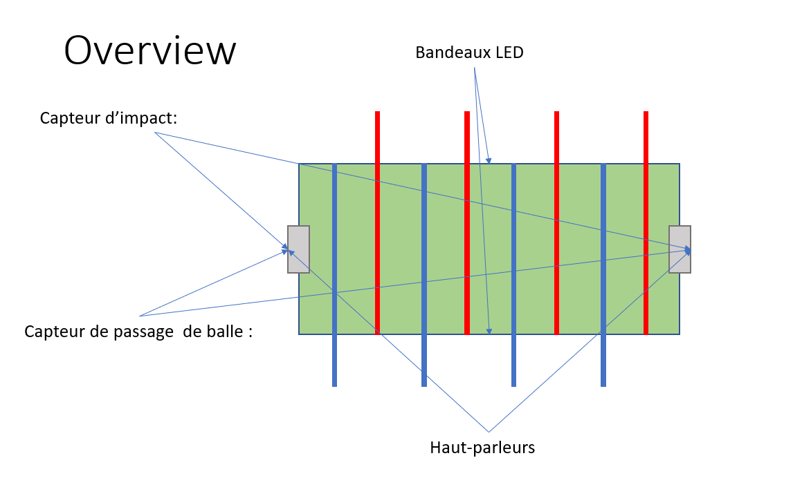

# Baby 2.0

## Sommaire 
- [Brief](#brief)
- [Architecture](#architecture)

 
## Brief

Ce projet consiste à gérer un bayfoot électroniquement, detection de buts, de gamelles, gestion de bandeaux de leds et haut parleurs.
 

## Architecture

# Installation

 - Installer Arduino CLI (for windows):
    - https://arduino.github.io/arduino-cli/0.19/installation/
    - https://downloads.arduino.cc/arduino-cli/arduino-cli_latest_Windows_64bit.zip
 - Installer VS Code :
    - https://code.visualstudio.com/
 - Installer extension VS Code arduino:
    - Extension Id : vsciot-vscode.vscode-arduino
 - Regarder dans le fichier '.vscode/arduino.json' si le path est le bon :     "arduino.path": "C:/Program Files (x86)/Arduino",
